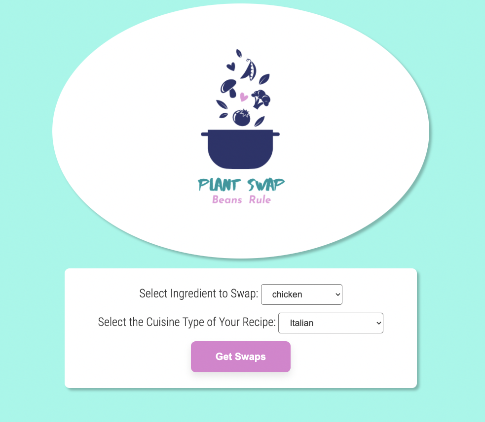

# _Plant Swap_

#### By: _*Kim Brannian*_

#### An app to find the best plant-based subs for your animal-based ingredients.

## Technologies Used
* HTML
* CSS
* Javascript
* React
* React-Bootstrap
* Package.json
* Webpack
* Babel

## Description
_This is a work in progress which I hope to finish and love enough to send a link to all my friends and family who constantly text me wondering what vegan substitution they could use in their recipes._ There is a lot of content to create for it, and that is where a lot of the work lies now. But this is a map for where it could go._

## UI

## Setup/Installation Requirement

 * First things first, you have to download the API until it is ready to be hosted. Go to https://github.com/kimberkay/PlantSwap.Solution.git and follow the set-up instructions there.  Then, move onto the following...

 * Open the terminal and navigate to your Desktop directory
 * Type the command git clone https://github.com/kimberkay/plant-swap-app.git
 * Open the cloned directory in your code editor
 * Run npm install to install dependencies
 * Type npm start to start the server and view the application.

 GLHF!
